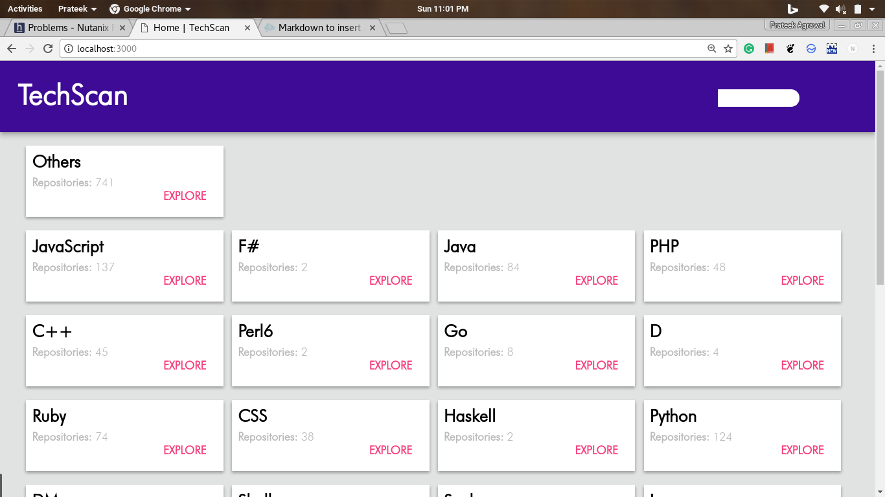
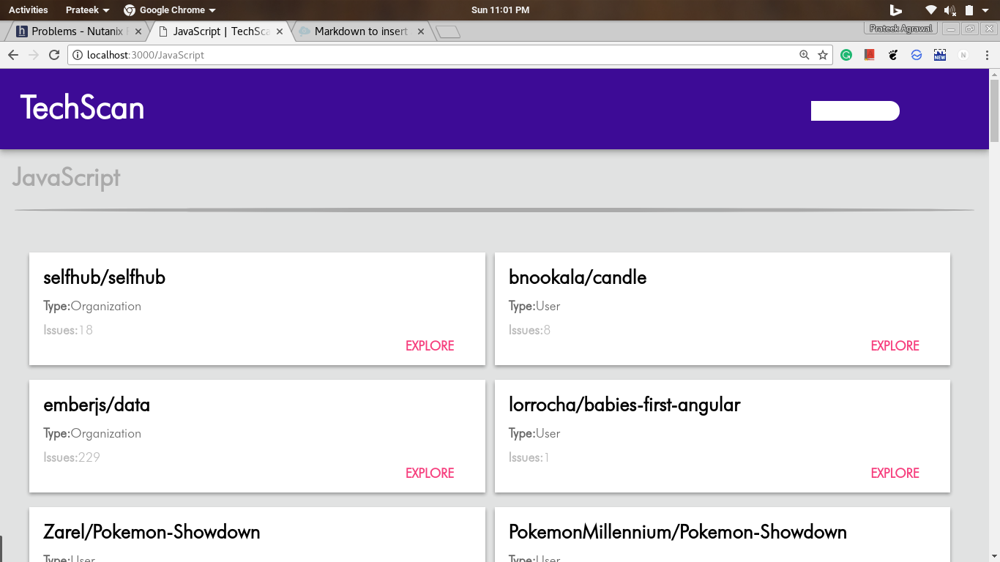
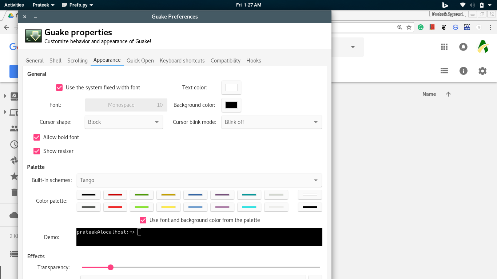
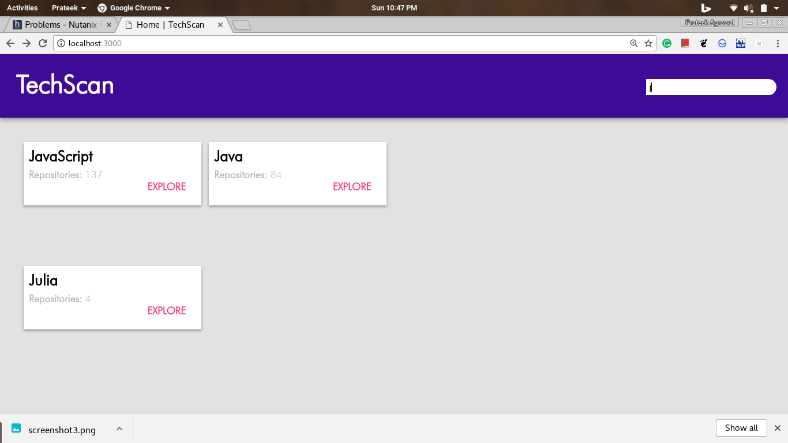
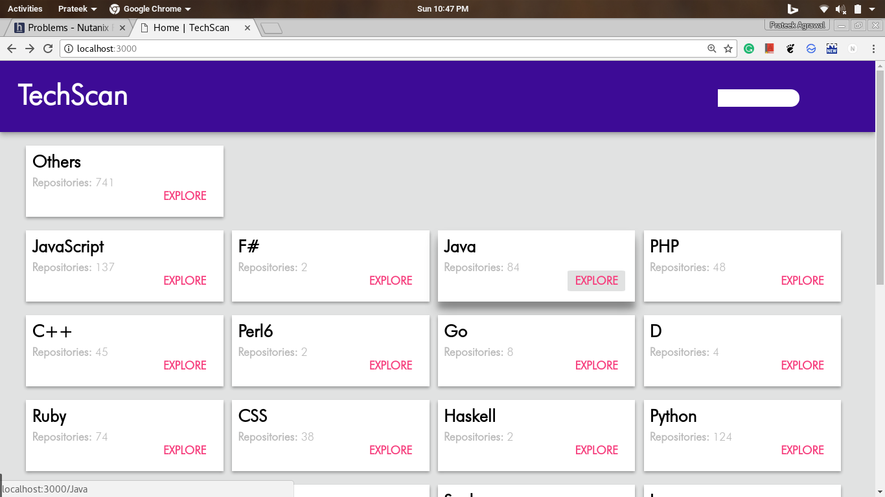

# TechScan Webapp

To run the app open terminal in project directory and type:
    
    node ./bin/www
    
Dependecies:

    Node6 or greater
    Npm v5.3.0 or greater
    OS: Linux or Unix

Components:
    
    Frontend: HTML, CSS, JavaScript
    Backend: Nodejs

Data:
    
    Json file
    
Screenshots:

